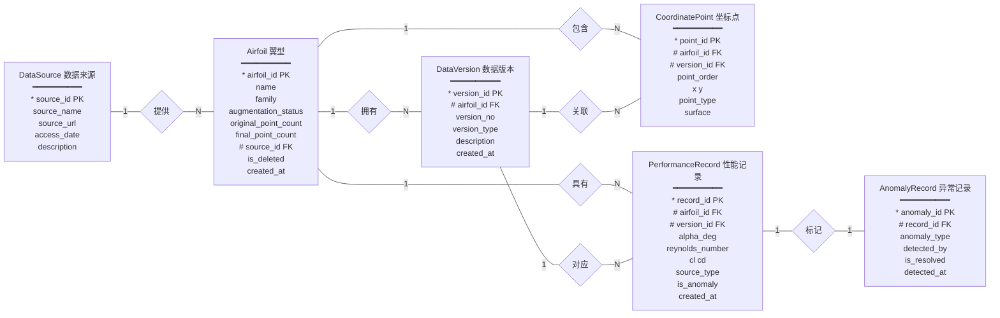
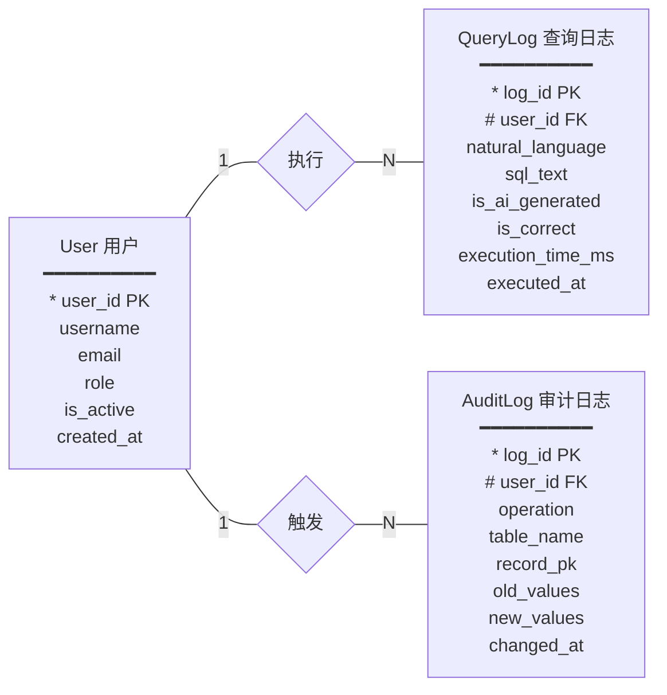

# 六、数据库设计

## 数据实体识别

基于 `data/` 文件夹下 70 个 `.dat` 文件（UIUC 翼型坐标数据），识别出以下实体：

| 实体 | 来源 | 记录量 | 说明 |
|------|------|--------|------|
| **Airfoil** | `.dat` 首行 + 注释元数据 | 70 | 翼型名称、家族、增广状态、坐标点数 |
| **CoordinatePoint** | `.dat` 坐标行 + 逐点标签 | ~8,552 | 每个点的 x, y, point_type(real/augmented), surface |
| **DataSource** | 项目元数据 | 2 | UIUC 公开数据库 + 课程程序生成 |
| **DataVersion** | 项目设计 | >=70 | 原始导入版本 + 后续派生版本 |
| **PerformanceRecord** | 程序生成 | >=3,000 | 升力/阻力系数，多攻角多雷诺数工况 |
| **User** | 系统设计 | >=2 | 系统操作人员 |
| **AnomalyRecord** | 异常注入+检测 | 少量 | 异常类型、检测方式 |
| **QueryLog** | AI 协同审计 | >=10 | 自然语言->SQL 记录及审计结果 |

---

## 6.1 概念建模 -- ER 图

`*` 标注主键(PK)、`#` 标注外键(FK)


### 6.1.1 核心数据 ER 图（含全部属性）




### 6.1.2 用户与审计 ER 图（含全部属性）



### 6.1.3 联系集汇总

| 联系名 | 参与实体 | 基数 | 说明 |
|--------|---------|:----:|------|
| 提供 | DataSource(1) — Airfoil(N) | 1 : N | 一个来源提供多个翼型 |
| 拥有 | Airfoil(1) — DataVersion(N) | 1 : N | 一个翼型拥有多个版本 |
| 包含 | Airfoil(1) — CoordinatePoint(N) | 1 : N | 一个翼型包含多个坐标点 |
| 关联 | DataVersion(1) — CoordinatePoint(N) | 1 : N | 一个版本确定一组坐标点 |
| 具有 | Airfoil(1) — PerformanceRecord(N) | 1 : N | 一个翼型对应多条性能记录 |
| 对应 | DataVersion(1) — PerformanceRecord(N) | 1 : N | 一个版本对应多条性能记录 |
| 标记 | PerformanceRecord(1) — AnomalyRecord(1) | 1 : 1 | 一条性能记录最多标记一种异常 |
| 执行 | User(1) — QueryLog(N) | 1 : N | 一个用户可执行多次查询 |
| 触发 | User(1) — AuditLog(N) | 1 : N | 一个用户的操作触发多条审计日志 |

### 6.1.4 核心关系文字描述

Airfoil 是中心实体，上游通过"提供"（1:N）关联 DataSource，下游通过三条 1:N 联系分别关联 DataVersion、CoordinatePoint、PerformanceRecord。DataVersion 作为枢纽，与 CoordinatePoint（关联）、PerformanceRecord（对应）各有一条 1:N 联系。AnomalyRecord 通过 1:1 联系"标记"依附于 PerformanceRecord。用户模块独立：User 通过"执行"、"触发"两条 1:N 联系分别关联 QueryLog 和 AuditLog。

---

## 6.2 逻辑结构设计

### 6.2.1 主键与外键设计

| 表 | 主键 | 外键 | 外键参照 |
|----|------|------|----------|
| `data_sources` | `source_id` (SERIAL) | -- | -- |
| `users` | `user_id` (SERIAL) | -- | -- |
| `airfoils` | `airfoil_id` (VARCHAR) | `source_id` | `data_sources.source_id` |
| `data_versions` | `version_id` (VARCHAR) | `airfoil_id` | `airfoils.airfoil_id` |
| `coordinate_points` | `point_id` (SERIAL) | `airfoil_id`, `version_id` | `airfoils`, `data_versions` |
| `performance_records` | `record_id` (SERIAL) | `airfoil_id`, `version_id` | `airfoils`, `data_versions` |
| `anomaly_records` | `anomaly_id` (SERIAL) | `record_id` | `performance_records.record_id` |
| `audit_log` | `log_id` (SERIAL) | `user_id` | `users.user_id` |
| `query_log` | `log_id` (SERIAL) | `user_id` | `users.user_id` |

**设计选择说明：**
- `airfoil_id` 使用从文件名派生的有意义的 VARCHAR（如 `naca2412`、`b737a`），而不是自增数字。原因：翼型标识在工程语境中本身具有业务含义，直接作为主键可避免额外的名称查找。
- `version_id` 使用拼接格式（如 `naca2412_v1`），天然携带所属翼型信息，且全局唯一。
- `coordinate_points` 和 `performance_records` 中同时保留了 `airfoil_id` 和 `version_id`，属于受控冗余：避免大量查询都需要 JOIN `data_versions` 表获取 `airfoil_id`。

### 6.2.2 函数依赖分析

**airfoils 表：**
```
airfoil_id -> name, family, augmentation_status, original_point_count, final_point_count, source_id, is_deleted
```
所有非主属性完全函数依赖于主键，不存在部分依赖或传递依赖。

**data_versions 表：**
```
version_id -> airfoil_id, version_no, version_type, description
(airfoil_id, version_no) -> version_id, version_type, description
```
存在两个候选键：`version_id` 和 `(airfoil_id, version_no)`。选定 `version_id` 为主键，`(airfoil_id, version_no)` 加 UNIQUE 约束。

**coordinate_points 表：**
```
point_id -> version_id, airfoil_id, point_order, x, y, point_type, surface, ...
(version_id, point_order) -> x, y, point_type, surface, airfoil_id, ...
point_order -> surface          <-- surface 仅依赖于 point_order（及总点数）
```
`surface` 由 `point_order` 相对于总点数的位置决定（上半 = "upper"，下半 = "lower"），存在传递依赖：`point_id -> point_order -> surface`。详见 6.2.3。

**performance_records 表：**
```
record_id -> airfoil_id, version_id, alpha_deg, reynolds_number, cl, cd, source_type, is_anomaly
(version_id, alpha_deg, reynolds_number) -> cl, cd, source_type, is_anomaly, airfoil_id
```
`(version_id, alpha_deg, reynolds_number)` 是自然候选键。

### 6.2.3 第三范式（3NF）分析

| 表 | 达到 3NF？ | 说明 |
|----|-----------|------|
| `data_sources` | 是 | 无传递依赖 |
| `users` | 是 | 无传递依赖 |
| `airfoils` | 是 | 所有非主属性直接依赖于主键 |
| `data_versions` | 是 | `version_id` 直接决定所有属性 |
| `coordinate_points` | **否** | `surface` 可由 `point_order` 推导，存在传递依赖 |
| `performance_records` | 是 | 无非主属性之间的依赖 |
| `anomaly_records` | 是 | 无传递依赖 |
| `audit_log` | 是 | JSONB 列仅存储日志快照 |
| `query_log` | 是 | 无传递依赖 |

**关于 `surface` 字段未达 3NF 的说明：**

`surface`（upper/lower）是由 `point_order` 及该版本总点数计算得出的派生属性。严格来说 `point_id -> point_order -> surface` 构成传递依赖，违反 3NF。

**为何保留这部分冗余：**
1. **查询性能**：`WHERE surface = 'upper'` 是高频查询条件（提取上表面坐标、计算厚度分布等），每次在应用层计算或窗口函数判断会显著降低效率。
2. **语义固定不变**：`surface` 的推导规则是确定性的（翼型坐标按上表面->前缘->下表面排列），不会产生数据不一致。
3. **存储代价低**：每行仅 5 字节，万级数据量可忽略。
4. **课程要求允许**：项目说明书第 6.2 条明确要求说明"若未达到第三范式，为什么保留部分冗余"。

如果追求严格 3NF，可通过视图替代：
```sql
CREATE VIEW v_coord_with_surface AS
SELECT *, CASE WHEN point_order <= (SELECT AVG(cnt)/2 FROM ...)
               THEN 'upper' ELSE 'lower' END AS surface
FROM coordinate_points;
```

### 6.2.4 联合索引建议

| 索引名 | 表 | 字段 | 类型 | 目标查询 |
|------|-----|------|------|----------|
| `idx_coord_version_order` | `coordinate_points` | `(version_id, point_order)` | 复合 | 获取某版本的完整几何外形 |
| `idx_perf_airfoil_version_alpha` | `performance_records` | `(airfoil_id, version_id, alpha_deg)` | 复合 | CL-alpha 曲线 |
| `idx_perf_reynolds` | `performance_records` | `(reynolds_number)` | 单列 | 同雷诺数下多翼型对比 |
| `idx_perf_anomaly` | `performance_records` | `(is_anomaly) WHERE is_anomaly=TRUE` | 部分 | 查询所有异常记录 |
| `idx_airfoil_family` | `airfoils` | `(family)` | 单列 | 按翼型家族分类统计 |
| `idx_version_airfoil_no` | `data_versions` | `(airfoil_id, version_no DESC)` | 复合 | 获取最新版本 |

**选择理由：**
- `coordinate_points` 最频繁的查询是"给定 version_id，按 point_order 排序取出全部坐标点"，复合索引 `(version_id, point_order)` 可实现覆盖索引扫描。
- `performance_records` 的核心查询是升力曲线 `WHERE airfoil_id=X AND version_id=Y ORDER BY alpha_deg`，复合索引 `(airfoil_id, version_id, alpha_deg)` 直接命中。
- 部分索引 `WHERE is_anomaly=TRUE` 比全表索引更高效：异常记录占比 < 1%，索引大小缩小 ~99%。

---

## 6.3 约束要求

### 6.3.1 主键约束

| 表 | 主键 |
|----|------|
| `data_sources` | `PRIMARY KEY (source_id)` |
| `users` | `PRIMARY KEY (user_id)` |
| `airfoils` | `PRIMARY KEY (airfoil_id)` |
| `data_versions` | `PRIMARY KEY (version_id)` |
| `coordinate_points` | `PRIMARY KEY (point_id)` |
| `performance_records` | `PRIMARY KEY (record_id)` |
| `anomaly_records` | `PRIMARY KEY (anomaly_id)` |
| `audit_log` | `PRIMARY KEY (log_id)` |
| `query_log` | `PRIMARY KEY (log_id)` |

### 6.3.2 外键约束

```sql
airfoils.source_id              -> data_sources.source_id
data_versions.airfoil_id        -> airfoils.airfoil_id          ON DELETE CASCADE
coordinate_points.airfoil_id    -> airfoils.airfoil_id          ON DELETE CASCADE
coordinate_points.version_id    -> data_versions.version_id     ON DELETE CASCADE
performance_records.airfoil_id  -> airfoils.airfoil_id          ON DELETE CASCADE
performance_records.version_id  -> data_versions.version_id     ON DELETE CASCADE
anomaly_records.record_id       -> performance_records.record_id ON DELETE CASCADE
audit_log.user_id               -> users.user_id
query_log.user_id               -> users.user_id
```

**级联策略：** 翼型被删除时，其版本、坐标、性能、异常记录同步删除（`ON DELETE CASCADE`）。用户表的外键不使用级联删除（保留审计日志）。

### 6.3.3 非空约束 (NOT NULL)

所有外键及核心业务字段均设为 NOT NULL：

| 表 | NOT NULL 字段 |
|----|---------------|
| `data_sources` | `source_name` |
| `users` | `username`, `email`, `role` |
| `airfoils` | `name`, `family`, `augmentation_status`, `original_point_count`, `final_point_count`, `source_id` |
| `data_versions` | `airfoil_id`, `version_no`, `version_type` |
| `coordinate_points` | `airfoil_id`, `version_id`, `point_order`, `x`, `y`, `point_type`, `surface` |
| `performance_records` | `airfoil_id`, `version_id`, `alpha_deg`, `reynolds_number`, `cl`, `cd`, `source_type` |
| `anomaly_records` | `record_id`, `anomaly_type`, `detected_by` |
| `audit_log` | `operation`, `table_name`, `record_pk` |
| `query_log` | `sql_text` |

坐标点的 `interpolation_method`、`between_original`、`t_value` 仅对 augmented 点有值，允许 NULL。

### 6.3.4 唯一约束 (UNIQUE)

| 表 | 唯一约束 | 防重复场景 |
|----|----------|------------|
| `users` | `UNIQUE (username)`, `UNIQUE (email)` | 用户注册唯一性 |
| `data_versions` | `UNIQUE (airfoil_id, version_no)` | 同一翼型不出现重复版本号 |
| `coordinate_points` | `UNIQUE (version_id, point_order)` | 同一版本下坐标序号不重复 |
| `performance_records` | `UNIQUE (version_id, alpha_deg, reynolds_number)` | **同一版本同一工况不重复插入** (* 说明书明确要求) |

### 6.3.5 检查约束 (CHECK)

```sql
-- airfoils
CHECK (augmentation_status IN ('original_real','augmented_from_real','generated_variant'))
CHECK (original_point_count > 0)
CHECK (final_point_count >= 80)            -- 说明书要求 >=80 坐标点

-- data_versions
CHECK (version_no >= 1)
CHECK (version_type IN ('imported_raw','augmented','generated_variant'))

-- coordinate_points
CHECK (point_order >= 1)
CHECK (x >= 0 AND x <= 1)                  -- 翼型弦向归一化坐标
CHECK (point_type IN ('real','augmented'))
CHECK (surface IN ('upper','lower'))

-- performance_records         (* 对应说明书明确列出的示例)
CHECK (cd >= 0)                             -- * Cd 必须大于等于 0
CHECK (alpha_deg >= -20 AND alpha_deg <= 25) -- * alpha 应在合理范围内
CHECK (reynolds_number > 0)

-- users
CHECK (role IN ('admin','engineer','analyst','viewer'))

-- anomaly_records
CHECK (anomaly_type IN ('negative_cd','extreme_cl','extreme_ld','out_of_range','duplicate'))
CHECK (detected_by IN ('rule','ai','manual'))
```

**说明书对应关系：**
- "阻力系数 Cd 必须大于等于 0" -> `CHECK (cd >= 0)`
- "攻角 alpha 应在合理范围内" -> `CHECK (alpha_deg >= -20 AND alpha_deg <= 25)`
- "同一版本下同一翼型同一工况不应重复插入" -> `UNIQUE (version_id, alpha_deg, reynolds_number)`

---

## 6.4 删除策略说明（衔接第八部分数据治理要求）

| 数据类型 | 删除策略 | 理由 |
|----------|----------|------|
| 翼型几何数据 (`airfoils`) | **逻辑删除** (`is_deleted=TRUE`) | 核心工程数据，需保留历史可追溯性 |
| 坐标数据 (`coordinate_points`) | 跟随翼型级联（逻辑删除时不动） | 坐标是翼型的组成部分 |
| 性能数据 (`performance_records`) | **逻辑删除** + 审计日志 | 已用于分析实验的性能数据不宜直接擦除 |
| 异常标记 (`anomaly_records`) | 允许物理删除（标记可修正） | 标记是治理结论，允许更正 |
| 审计日志 (`audit_log`) | **禁止删除** | 审计日志是不可篡改的操作记录 |
